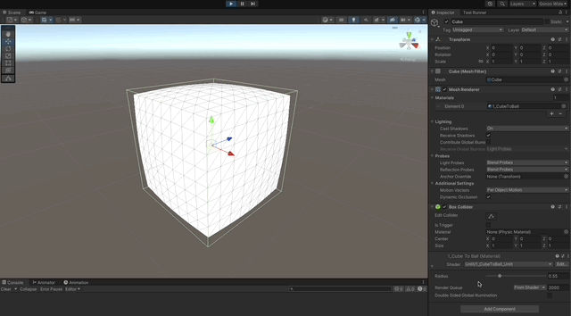
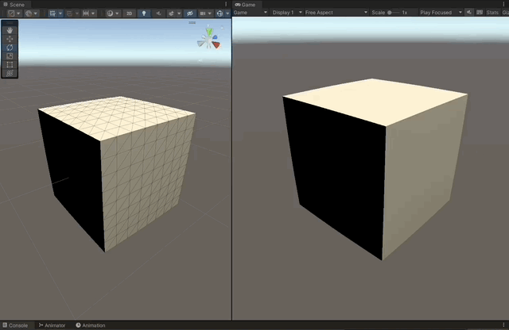

# Ball of Lava Shader

Ball of Lava Shader implemented with the **Cg** shader programming language for the Built-In RP in **Unity 2021.3.10f1**

### References

- [Learn Unity Shaders from Scratch course by Nik Lever](https://www.udemy.com/course/learn-unity-shaders-from-scratch)

## Shaders

- [Oscillating shape-shifting](#oscillating-shape-shifting)
- [Lighting](#lighting)

## Screenshots

---

## Oscillating shape-shifting

1. Calculate a normalized ray vector from the center of the object, to the vertex.
1. Multiply by the desired shpere radius, to shape the intended sphere object.
1. Use `lerp` and a `sin` of `_Time` to oscillate between the cube and sphere shapes.

```c
v2f vert (appdata_base v)
{
      v2f output;

      // calculate position of vertices in a sphere of radius
      float3 normalizedRadialRay = normalize(v.vertex.xyz);
      float4 spherePos = float4(normalizedRadialRay * _Radius, v.vertex.w);

      // oscillate between the two positions
      float delta = (sin(_Time.w) + 1.0) / 2.0;
      float4 oscillatingPos = lerp(v.vertex * 50.0, spherePos, delta);

      output.vertex = UnityObjectToClipPos(oscillatingPos);
      // output.position = v.vertex;
      // output.uv = v.texcoord;

      return output;
}
```



## Lighting

1. Use `UnityLightingCommon.cginc` for common lighting functions and values.
1. Calculate the `UnityObjectToWorldNormal` using the current normal of the vertex.
1. Make sure to `lerp` the current normal of the vertex between the one it has in the cube shape, and the one it has in the sphere shape.
1. Do the `dot` product between the vertex normal and the light direction in `_WorldSpaceLightPos0.xyz`.
1. This scalar value represents the influence of the light in the color of the pixel.
1. Calculate the diffuse color multiplying the `dot` scalar value by `_LightColor0`.

```c
#include "UnityLightingCommon.cginc"

v2f vert (appdata_base v)
{
      ...

      // calculate lighting
      float3 lightDirection = _WorldSpaceLightPos0.xyz;

      float3 lerpedNormal = lerp(v.normal, normalizedRadialRay, delta);
      half3 worldNormal = UnityObjectToWorldNormal(lerpedNormal);

      // dot product between normal and light vector, provide the basis for the lit shading
      half lightInfluence = max(0, dot(worldNormal, lightDirection)); // avoid negative values
      output.diff = lightInfluence * _LightColor0;

      ...
}
```


