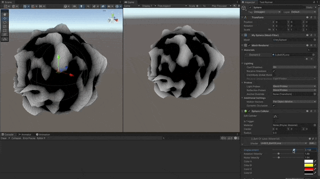
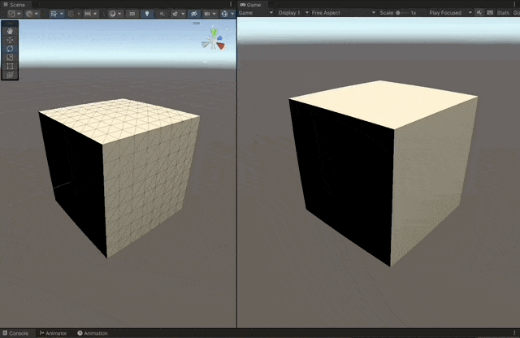
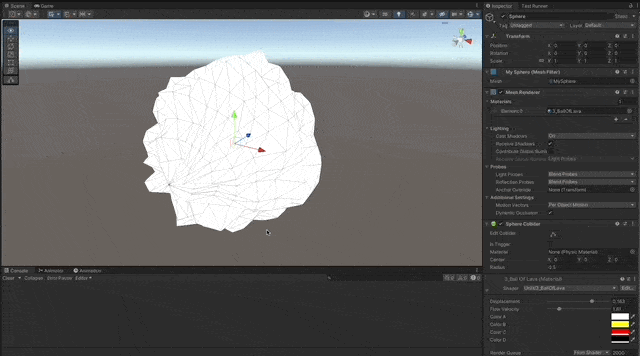

# Ball of Lava Shader

Ball of Lava Shader implemented with the **Cg** shader programming language for the Built-In RP in **Unity 2021.3.10f1**

### References

- [Learn Unity Shaders from Scratch course by Nik Lever](https://www.udemy.com/course/learn-unity-shaders-from-scratch)

## Shaders

- [Oscillating shape-shifting](#oscillating-shape-shifting)
- [Lighting](#lighting)
- [Ball of Lava](#ball-of-lava)

## Screenshots



---

## Oscillating shape-shifting

1. Calculate a normalized ray vector from the center of the object, to the vertex.
1. Multiply by the desired shpere radius, to shape the intended sphere object.
1. Use `lerp` and a `sin` of `_Time` to oscillate between the cube and sphere shapes.

```c
v2f vert (appdata_base v)
{
      v2f output;

      // calculate position of vertices in a sphere of radius
      float3 normalizedRadialRay = normalize(v.vertex.xyz);
      float4 spherePos = float4(normalizedRadialRay * _Radius, v.vertex.w);

      // oscillate between the two positions
      float delta = (sin(_Time.w) + 1.0) / 2.0;
      float4 oscillatingPos = lerp(v.vertex * 50.0, spherePos, delta);

      output.vertex = UnityObjectToClipPos(oscillatingPos);
      // output.position = v.vertex;
      // output.uv = v.texcoord;

      return output;
}
```


## Lighting

1. Use `UnityLightingCommon.cginc` for common lighting functions and values.
1. Calculate the `UnityObjectToWorldNormal` using the current normal of the vertex.
1. Make sure to `lerp` the current normal of the vertex between the one it has in the cube shape, and the one it has in the sphere shape.
1. Do the `dot` product between the vertex normal and the light direction in `_WorldSpaceLightPos0.xyz`.
1. This scalar value represents the influence of the light in the color of the pixel.
1. Calculate the diffuse color multiplying the `dot` scalar value by `_LightColor0`.

```c
#include "UnityLightingCommon.cginc"

v2f vert (appdata_base v)
{
      ...

      // calculate lighting
      float3 lightDirection = _WorldSpaceLightPos0.xyz;

      float3 lerpedNormal = lerp(v.normal, normalizedRadialRay, delta);
      half3 worldNormal = UnityObjectToWorldNormal(lerpedNormal);

      // dot product between normal and light vector, provide the basis for the lit shading
      half lightInfluence = max(0, dot(worldNormal, lightDirection)); // avoid negative values
      output.diff = lightInfluence * _LightColor0;

      ...
}
```



## Ball of Lava

1. Generate a Mesh and make sure the UV map wraps correctly, so the Perlin noise doesn't generate weird shapes in the mesh.
1. Use the **Perlin Noise** algorithm to displace the vertices given the noise function.
1. Use `_Time` to animate the Perlin Noise, also multiply by `_Displacement` and `_NoiseVelocity` to control how much and how fast the noise is.
1. Displace the `uv` coordinates to simulate rotation, multiply by `_RotationVelocity` to control the speed.

```c
// move the uvs to simulate lava flow
float2 uvs = (v.texcoord + (_Time.x * _RotationVelocity)) % 1.0;

// use 8x8 grid, with a changing time to animate the lava
float perlinNoise = perlin(uvs, 12, 12, _Time.y * _NoiseVelocity); // from 0 to 1
float noise = ( perlinNoise - 0.5) * 2; // from -1.0 to 1.0
// amplify the noise given parameter
float displacement = noise * _Displacement;

// displace the vertex given the noise function value
float3 displacedPos = v.vertex * (1 + displacement);
float4 vertexPosition = float4(displacedPos * 80.0, v.vertex.w);
```




